# TabPFN vs. Naive AutoML

Here we compare the TabPFN with Naive AutoML (https://github.com/fmohr/naiveautoml) in terms of accuracy.
Naive AutoML is a highly competitive AutoML tool, which usually outperforms vanilla auto-sklearn in the sense that good solutions are found (much) faster.

## Conditions
### Datasets
A selection of 81 datasets we used for LCDB (https://github.com/fmohr/lcdb), which comply with the restrictions imposed by TabPFN:
- without categorical attributes
- at most 10 classes
- at most 100 features

Check the config file (or result logs below) to see which datasets were used.

Datasets in which we had more than 1000 instances were split so that at most 1000 of the instances were used for training (rest for testing).

### TabPFN
used with ensembling of 4

### Naive AutoML
used with a very short HPO phase of 10 (purely random) hyperparameter configurations; no BO etc. is applied. No ensembles.

In this setup, it is basically a *greedy algorithm selection* + tiny HPO phase.

## Results
### Test Accuracy

From this, TabPFN gives really impressive results (at least to me). However, it seems not generally competitive with AutoML tools yet. Things to keep in mind for the cases where TabPFN beats Naive AutoML:
- Naive AutoML has only a very weak support for neural networks (only fully connected, and hardly fine tuned)
- Naive AutoML does not apply any ensembling (except pre-build ensemblers like RandomForests)
- It is unclear whether some of the datasets used here were part of TabPFN's meta-learning phase, which would be an unfair advantage

### Accuracies over Runtime
What makes TabPFN really exciting is its runtime behavior.
However, since most of these datasets are small, runtime is also quite short for Naive AutoML most of the times.
Here, we have the plots only for seed = 0, the other plots are also in the repository.
Also, recall that Naive AutoML is a very simple (even though strong and usually better than auto-sklearn) baseline for AutoML.
So, despite its surprisingly strong performance, TabPFN has still quite some way to go to be able to claim to reach or improve over SOTA.

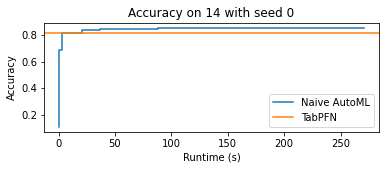

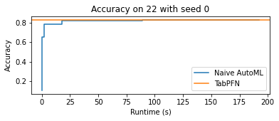

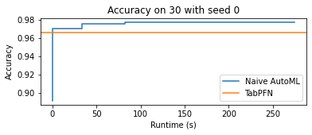
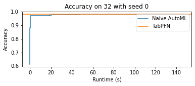
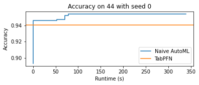

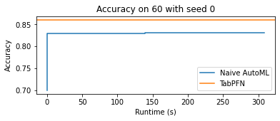

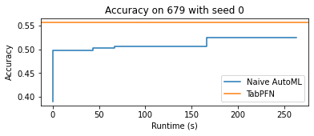

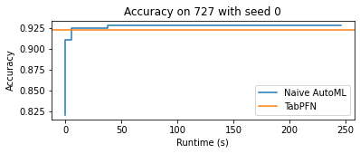
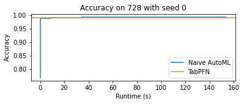

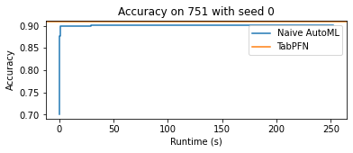

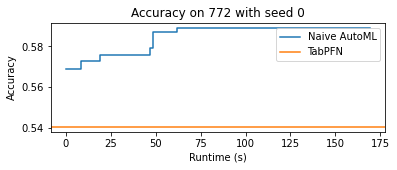
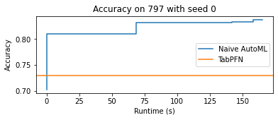

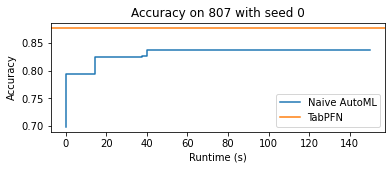
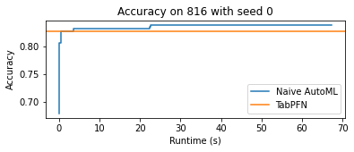

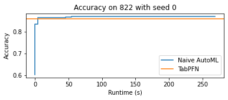
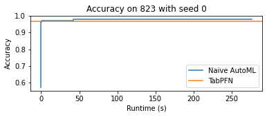

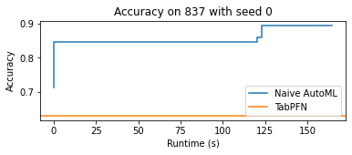
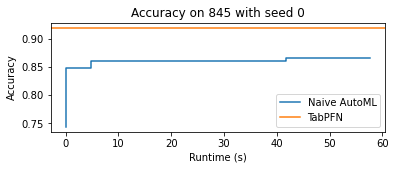
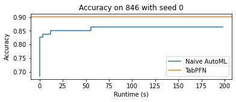

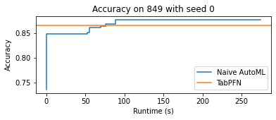
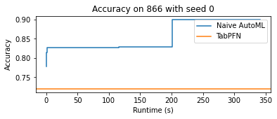

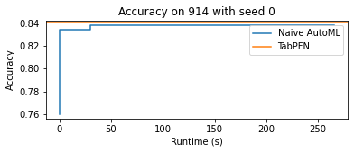

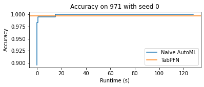
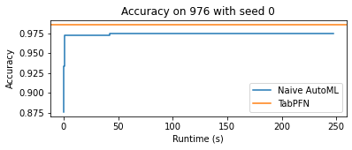

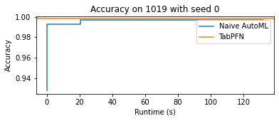

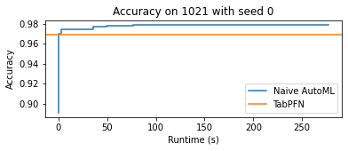
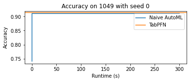
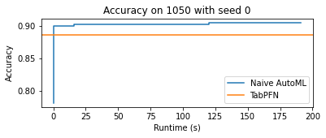

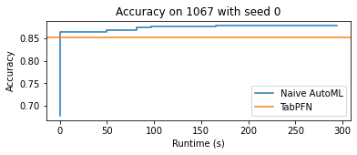

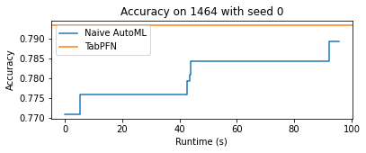
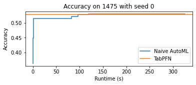
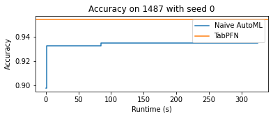
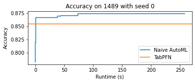
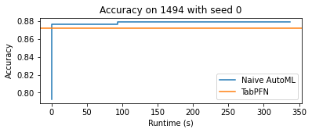

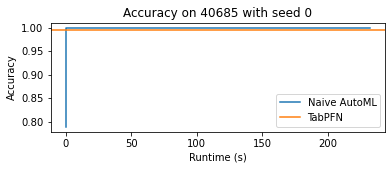

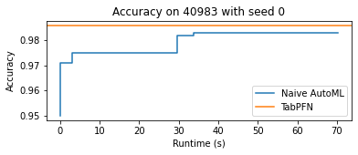
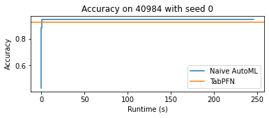

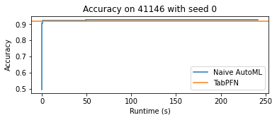
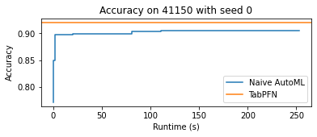
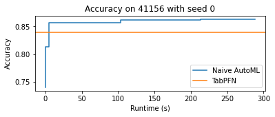

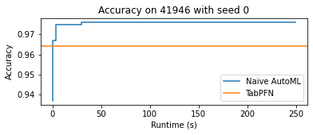
